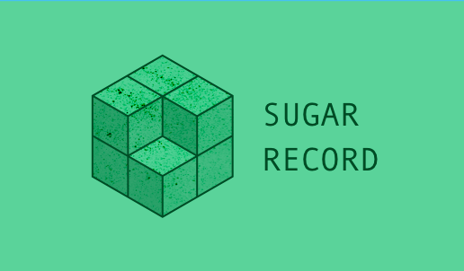

# <center></center>

[](https://twitter.com/carambalabs)
[](https://img.shields.io/cocoapods/v/SugarRecord.svg)
[](https://developer.apple.com/swift/)
[](http://opensource.org/licenses/MIT)
[](https://travis-ci.org/carambalabs/SugarRecord)
[](https://github.com/Carthage/Carthage)

## What is SugarRecord?
SugarRecord is a persistence wrapper designed to make working with persistence solutions like CoreData in a much easier way. Thanks to SugarRecord you'll be able to use CoreData with just a few lines of code: Just choose your stack and start playing with your data.

The library is maintained by [@carambalabs](https://github.com/carambalabs). You can reach me at [pepibumur@gmail.com](mailto://pepibumur@gmail.com) for help or whatever you need to commend about the library.

[](https://www.paypal.com/cgi-bin/webscr?cmd=_s-xclick&hosted_button_id=2AUKNEW4JLPXQ)


## Features
- Swift 3.0 compatible (Xcode 8.0).
- Protocols based design.
- For **beginners** and **advanced** users
- Fully customizable. Build your own stack!
- Friendly syntax (fluent)
- Away from Singleton patterns! No shared states :tada:
- Compatible with OSX/iOS/watchOS/tvOS
- Fully tested (thanks Nimble and Quick)
- Actively supported

## Setup

### [CocoaPods](https://cocoapods.org)

1. Install [CocoaPods](https://cocoapods.org). You can do it with `gem install cocoapods`
2. Edit your `Podfile` file and add the following line `pod 'SugarRecord'`
3. Update your pods with the command `pod install`
4. Open the project from the generated workspace (`.xcworkspace` file).

*Note: You can also test the last commits by specifying it directly in the Podfile line*

**Available specs**
Choose the right one depending ton the configuration you need for you app.

```ruby
pod "SugarRecord/CoreData"
pod "SugarRecord/CoreData+iCloud"
```

### [Carthage](https://github.com/carthage)

1. Install [Carthage](https://github.com/carthage). You can do it with `brew install carthage`.
2. Edit your `Cartfile` file and add the following line `github "carambalabs/sugarrecord".
3. Execute `carthage update`
4. Add the frameworks to your project as explained on the [Carthage repository](https://github.com/carthage).

### Reactive programming

We provide extensions for SugarRecord that offer a reactive interface to the library:

- [RxSugarRecord](https://github.com/carambalabs/rxsugarrecord)
- [RACSugarRecord](https://github.com/carambalabs/racsugarrecord)

## Reference
You can check generated SugarRecord documentation [here](http://cocoadocs.org/docsets/SugarRecord/2.0.0/) generated automatically with [CocoaDocs](http://cocoadocs.org/)

# How to use

#### Creating your Storage
A storage represents your database. The first step to start using SugarRecord is initializing the storage. SugarRecord provides a default storages, `CoreDataDefaultStorage`.

```swift
// Initializing CoreDataDefaultStorage
func coreDataStorage() -> CoreDataDefaultStorage {
    let store = CoreData.Store.Named("db")
    let bundle = Bundle(forClass: self.classForCoder())
    let model = CoreData.ObjectModel.merged([bundle])
    let defaultStorage = try! CoreDataDefaultStorage(store: store, model: model)
    return defaultStorage
}
```

##### Creating an iCloud Storage

SugarRecord supports the integration of CoreData with iCloud. It's very easy to setup since it's implemented in its own storage that you can use from your app, `CoreDataiCloudStorage`:

```swift
// Initializes the CoreDataiCloudStorage
func icloudStorage() -> CoreDataiCloudStorage {
    let bundle = Bundle(forClass: self.classForCoder())
    let model = CoreData.ObjectModel.merged([bundle])
    let icloudConfig = CoreDataiCloudConfig(ubiquitousContentName: "MyDb", ubiquitousContentURL: "Path/", ubiquitousContainerIdentifier: "com.company.MyApp.anothercontainer")
    return CoreDataiCloudStorage(model: model, iCloud: icloudConfig)
}
```

#### Contexts
Storages offer multiple kind of contexts that are the entry points to the database. For curious developers, in case of CoreData a context is a wrapper around `NSManagedObjectContext`. The available contexts are:

- **MainContext:** Use it for main thread operations, for example fetches whose data will be presented in the UI.
- **SaveContext:** Use this context for background operations. The context is initialized when the storage instance is created. That context is used for storage operations.
- **MemoryContext:** Use this context when you want to do some tests and you don't want your changes to be persisted.

#### Fetching data

```swift
let pedros: [Person] = try! db.fetch(FetchRequest<Person>().filtered(with: "name", equalTo: "Pedro"))
let tasks: [Task] = try! db.fetch(FetchRequest<Task>())
let citiesByName: [City] = try! db.fetch(FetchRequest<City>().sorted(with: "name", ascending: true))
let predicate: NSPredicate = NSPredicate(format: "id == %@", "AAAA")
let john: User? = try! db.fetch(FetchRequest<User>().filtered(with: predicate)).first
```

#### Remove/Insert/Update operations

Although `Context`s offer `insertion` and `deletion` methods that you can use it directly SugarRecords aims at using the `operation` method method provided by the storage for operations that imply modifications of the database models:

- **Context**: You can use it for fetching, inserting, deleting. Whatever you need to do with your data.
- **Save**: All the changes you apply to that context are in a memory state unless you call the `save()` method. That method will persist the changes to your store and propagate them across all the available contexts.

```swift
do {
  db.operation { (context, save) throws in
    // Do your operations here
    try save()
  }
} catch {
  // There was an error in the operation
}
```

##### New model
You can use the context `new()` method to initialize a model **without inserting it in the context**:

```swift
do {
  db.operation { (context, save) throws in
    let newTask: Track = try context.new()
    newTask.name = "Make CoreData easier!"
    try context.insert(newTask)
    try save()
  }
} catch {
  // There was an error in the operation
}
```
> In order to insert the model into the context you use the insert() method.

##### Creating a model
You can use the `create()` for initializing and inserting in the context in the same operation:

```swift
do {
  db.operation { (context, save) throws -> Void in
    let newTask: Track = try! context.create()
    newTask.name = "Make CoreData easier!"
    save()
  }
}
catch {
  // There was an error in the operation
}
```

##### Delete a model
In a similar way you can use the `remove()` method from the context passing the objects you want to remove from the database:

```swift
do {
  db.operation { (context, save) throws in
    let john: User? = try context.request(User.self).filteredWith("id", equalTo: "1234").fetch().first
    if let john = john {
      try context.remove([john])
      try save()
    }
  }
} catch {
  // There was an error in the operation
}
```

<br>
> This is the first approach of SugarRecord for the  interface. We'll improve it with the feedback you can report and according to the use of the framework. Do not hesitate to reach us with your proposals. Everything that has to be with making the use of CoreData easier, funnier, and enjoyable is welcome! :tada:

### RequestObservable

SugarRecord provides a component, `RequestObservable` that allows observing changes in the DataBase. It uses `NSFetchedResultsController` under the hood.

**Observing**

```swift
class Presenter {
  var observable: RequestObservable<Track>!

  func setup() {
      let request: FetchRequest<Track> = FetchRequest<Track>().filtered(with: "artist", equalTo: "pedro")
      self.observable = storage.instance.observable(request)
      self.observable.observe { changes in
        case .Initial(let objects):
          print("\(objects.count) objects in the database")
        case .Update(let deletions, let insertions, let modifications):
          print("\(deletions.count) deleted | \(insertions.count) inserted | \(modifications.count) modified")
        case .Error(let error):
          print("Something went wrong")
      }
  }
}
```
> **Retain**: RequestObservable must be retained during the observation lifecycle. When the `RequestObservable` instance gets released from memory it stops observing changes from your storage.

> **NOTE**: This was renamed from Observable -> RequestObservable so we are no longer stomping on the RxSwift Observable namespace.

**:warning: `RequestObservable` is not available for CoreData + OSX**

## Resources
- [Quick](https://github.com/quick/quick)
- [Nimble](https://github.com/quick/nimble)
- [CoreData and threads with GCD](http://www.cimgf.com/2011/05/04/core-data-and-threads-without-the-headache/)
- [Jazzy](https://github.com/realm/jazzy)
- [iCloud + CoreData (objc.io)](http://www.objc.io/issue-10/icloud-core-data.html)

## About


This project is funded and maintained by [Caramba](http://caramba.io). We 💛 open source software!

Check out our other [open source projects](https://github.com/carambalabs/), read our [blog](http://blog.caramba.io) or say :wave: on twitter [@carambalabs](http://twitter.com/carambalabs).

## Contribute

Contributions are welcome :metal: We encourage developers like you to help us improve the projects we've shared with the community. Please see the [Contributing Guide](https://github.com/carambalabs/Foundation/blob/master/CONTRIBUTING.md) and the [Code of Conduct](https://github.com/carambalabs/Foundation/blob/master/CONDUCT.md).

## License
The MIT License (MIT)

Copyright (c) <2014> <Pedro Piñera>

Permission is hereby granted, free of charge, to any person obtaining a copy
of this software and associated documentation files (the "Software"), to deal
in the Software without restriction, including without limitation the rights
to use, copy, modify, merge, publish, distribute, sublicense, and/or sell
copies of the Software, and to permit persons to whom the Software is
furnished to do so, subject to the following conditions:

The above copyright notice and this permission notice shall be included in
all copies or substantial portions of the Software.

THE SOFTWARE IS PROVIDED "AS IS", WITHOUT WARRANTY OF ANY KIND, EXPRESS OR
IMPLIED, INCLUDING BUT NOT LIMITED TO THE WARRANTIES OF MERCHANTABILITY,
FITNESS FOR A PARTICULAR PURPOSE AND NONINFRINGEMENT. IN NO EVENT SHALL THE
AUTHORS OR COPYRIGHT HOLDERS BE LIABLE FOR ANY CLAIM, DAMAGES OR OTHER
LIABILITY, WHETHER IN AN ACTION OF CONTRACT, TORT OR OTHERWISE, ARISING FROM,
OUT OF OR IN CONNECTION WITH THE SOFTWARE OR THE USE OR OTHER DEALINGS IN
THE SOFTWARE.
